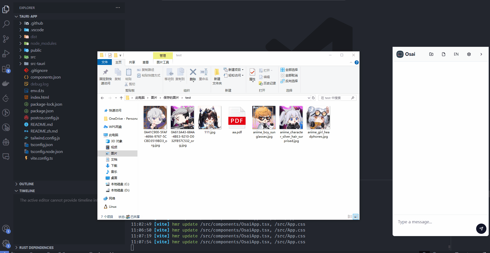
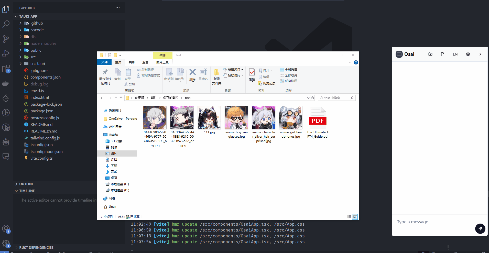
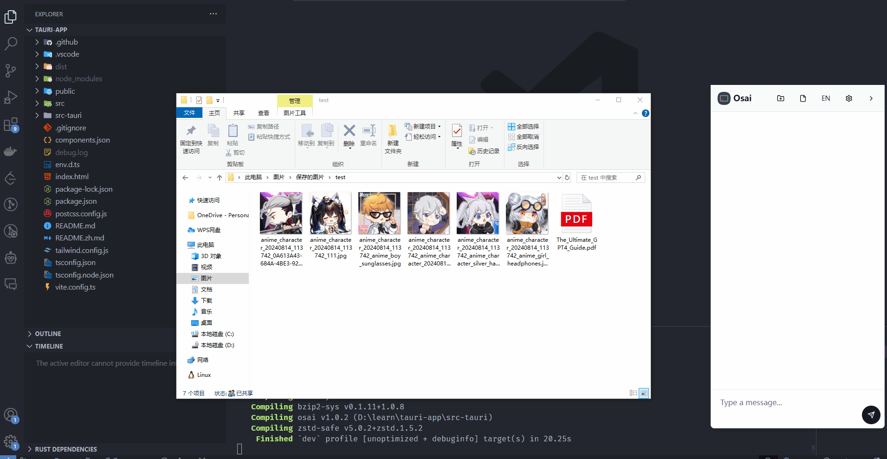
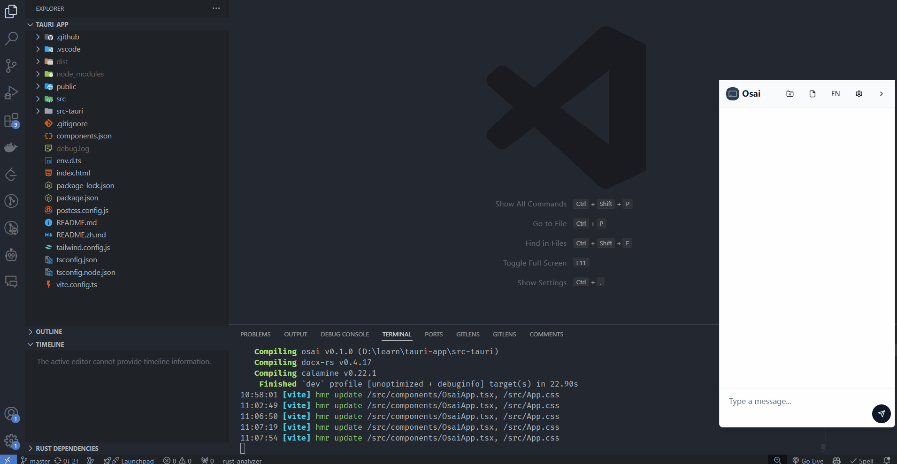
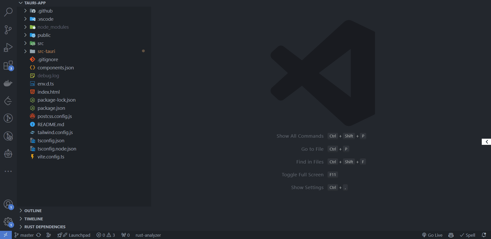
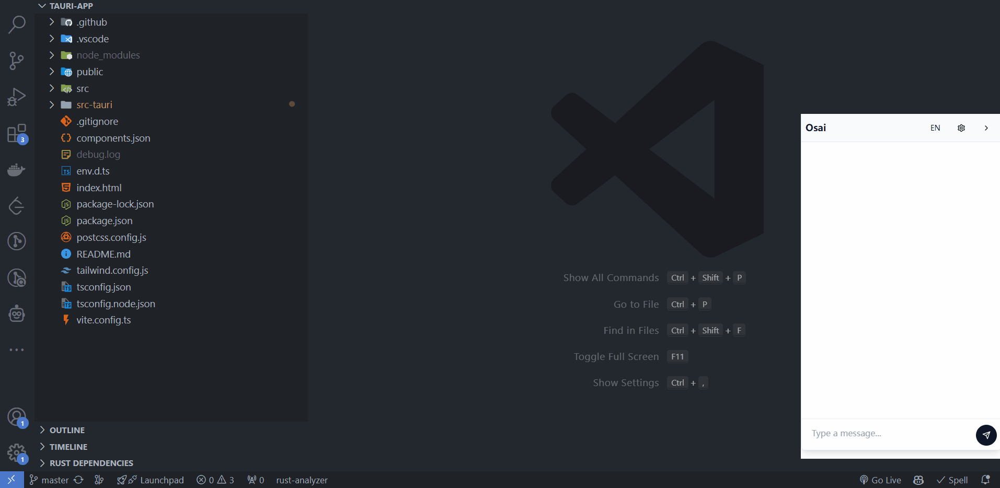
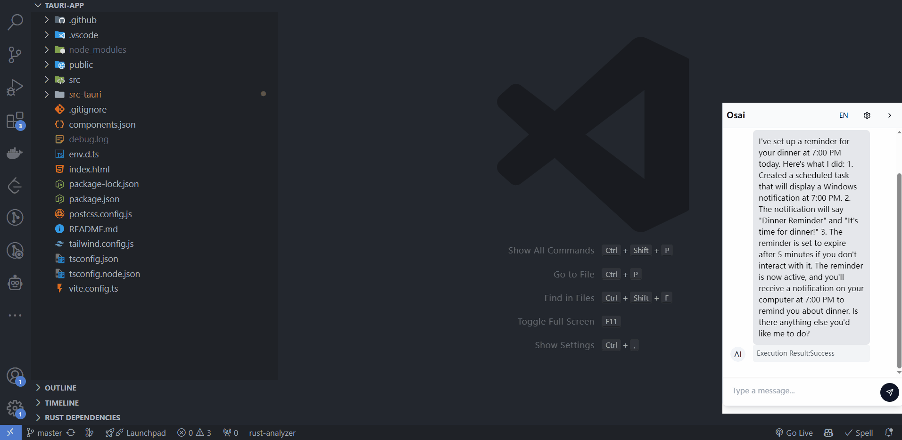

# OSAI: Asistente Inteligente de Sistema Operativo

OSAI es un asistente de sistema operativo impulsado por IA diseñado para mejorar la experiencia del usuario a través de la interacción por lenguaje natural. Integra capacidades de IA potentes para comprender y ejecutar diversas tareas a nivel de sistema para Windows, macOS y Linux, ofreciendo soluciones inteligentes para la gestión y el control del sistema operativo.

**La funcionalidad de OSAI no se limita a las características mostradas a continuación; sus capacidades solo están limitadas por cómo decidas utilizarlo.**

[中文文档](./README.zh.md)

## Muestra de Funcionalidades

### 1. Explicar y renombrar archivos PDF



### 2. Renombrar imágenes en lotes



### 3. Clasificar archivos por estilo y tipo



### 4. Agregar, ver y eliminar variables de entorno



### 5. Abrir YouTube y buscar IA



### 6. Agregar notificaciones del sistema



### 7. Abrir notificaciones del sistema



## Guía de Operación Básica

El uso requiere una clave de API de Claude. Haz clic [aquí](https://console.anthropic.com/settings/keys) para obtener una y agrégala en la configuración de la aplicación.

## Requisitos Técnicos

- Node.js
- Rust
- Tauri CLI

## Guía de Instalación

1. Clona el repositorio del proyecto:
   ```
   git clone https://github.com/Ancss/osai.git
   ```
2. Navega al directorio del proyecto:
   ```
   cd osai
   ```
3. Instala las dependencias:
   ```
   npm install
   ```

## Instrucciones de Uso

1. Inicia el modo de desarrollo:
   ```
   npm run tauri dev
   ```
2. Construye la versión para producción:
   ```
   npm run tauri build
   ```
