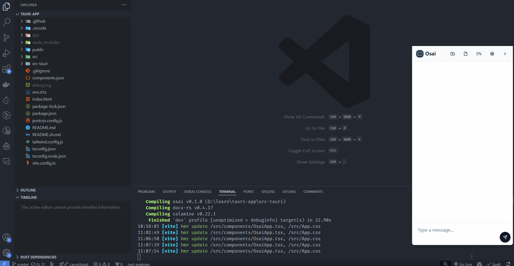
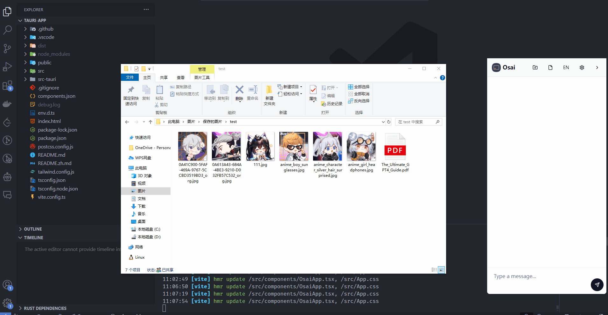
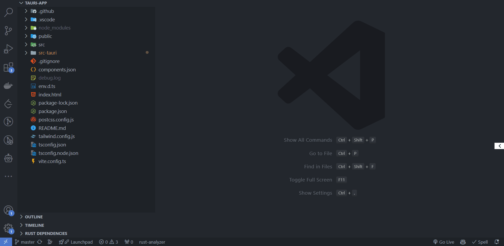
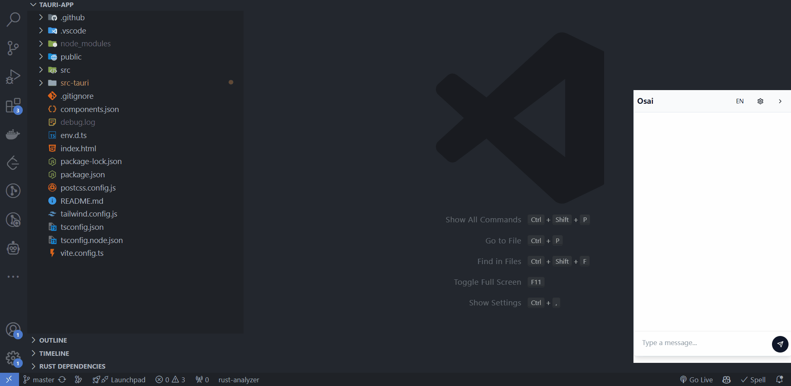
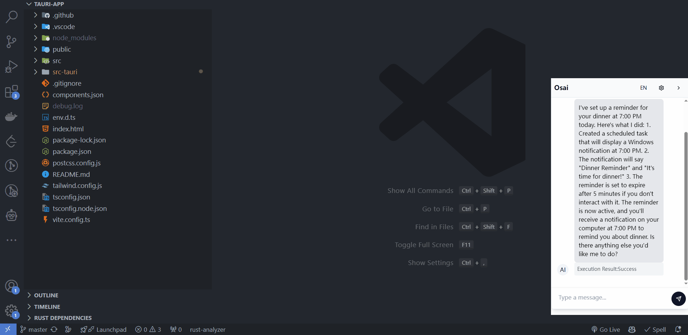

# OSAI: Intelligent Operating System Assistant

OSAI is an AI-powered operating system assistant designed to enhance the user's operating system experience through natural language interaction. It integrates powerful AI capabilities to understand and execute various system-level tasks, providing intelligent solutions for operating system management and control.

**OSAI's functionality is not limited to the features showcased below; its capabilities are only limited by how you choose to use it.**

## Feature Showcase

### 1. Explain and Rename PDF Files



### 2. Batch Rename Images



### 3. Classify Files by Style and Type


### 4. Add, View, and Delete Environment Variables


### 5. Open YouTube and Search for AI



### 6. Add System Notifications



### 7. Open System Notifications



## Basic Operation Guide

Usage requires a Claude API key. Please click [here](https://console.anthropic.com/settings/keys) to obtain one, and add it in the application settings.

## Technical Requirements

- Node.js
- Rust
- Tauri CLI

## Installation Guide

1. Clone the project repository:
   ```
   git clone https://github.com/Ancss/osai.git
   ```
2. Navigate to the project directory:
   ```
   cd osai
   ```
3. Install dependencies:
   ```
   npm install
   ```

## Usage Instructions

1. Start development mode:
   ```
   npm run tauri dev
   ```
2. Build production version:
   ```
   npm run tauri build
   ```
