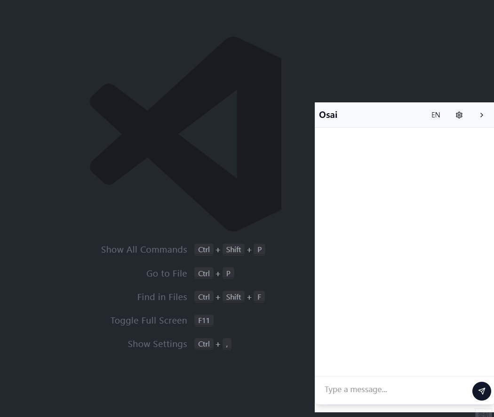

# OSAI：智能操作系统助手

OSAI 是一个创新的操作系统 AI 助手，旨在通过自然语言交互增强用户的操作系统使用体验。它集成了强大的 AI 能力，可以理解并执行各种系统级任务，为用户提供智能化的操作系统管理和控制方案。

## 功能展示

### 1. 打开 youtube 并搜索 Ai


### 2. 添加系统通知


#### 打开系统通知


### 3. 添加、查看、删除环境变量



## 即将推出的功能

- **多文件 AI 重命名**：通过 AI 分析文件内容，自动为批量文件生成有意义的名称。
- **AI 驱动的文件分类**：智能识别文件类型和内容，自动组织和分类文件。
- **语音控制集成**：支持语音指令，实现免手操作的系统控制体验。

## 基本操作指南

使用需要 claude api key, 请点击[这里获取](https://console.anthropic.com/settings/keys)，并打开应用在设置里添加

## 技术要求

- Node.js
- Rust
- Tauri CLI

## 安装指南

1. 克隆项目仓库：
   ```
   git clone https://github.com/Ancss/osai.git
   ```
2. 进入项目目录：
   ```
   cd osai
   ```
3. 安装依赖：
   ```
   npm install
   ```

## 使用说明

1. 启动开发模式：
   ```
   npm run tauri dev
   ```
2. 构建生产版本：
   ```
   npm run tauri build
   ```
