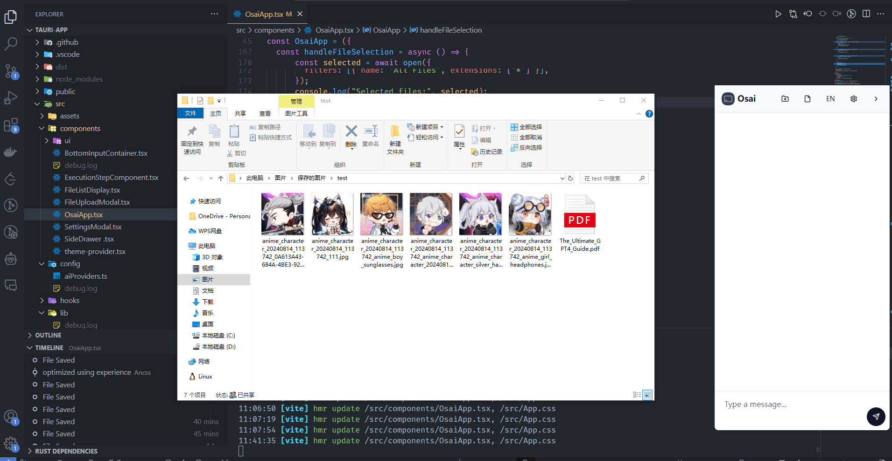

# OSAI：智能操作系统助手

OSAI 是一个操作系统 AI 助手，旨在通过自然语言交互增强用户的操作系统使用体验。它集成了强大的 AI 能力，可以理解并执行各种系统级任务，为用户提供智能化的操作系统管理和控制方案。

**OSAI 的功能不仅仅只有如下的功能展示，OSAI 的功能只取决于你想如何使用它。**

## 功能展示

### 1. 解释、重命名 PDF 文件


### 2. 批量重命名图片


### 3. 文件按照风格和类型进行分类



### 4. 添加、查看、删除环境变量


### 5. 打开 youtube 并搜索 Ai


### 6. 添加系统通知


### 7.打开系统通知


## 基本操作指南

使用需要 claude api key, 请点击[这里获取](https://console.anthropic.com/settings/keys)，并打开应用在设置里添加

## 技术要求

- Node.js
- Rust
- Tauri CLI

## 安装指南

1. 克隆项目仓库：
   ```
   git clone https://github.com/Ancss/osai.git
   ```
2. 进入项目目录：
   ```
   cd osai
   ```
3. 安装依赖：
   ```
   npm install
   ```

## 使用说明

1. 启动开发模式：
   ```
   npm run tauri dev
   ```
2. 构建生产版本：
   ```
   npm run tauri build
   ```
